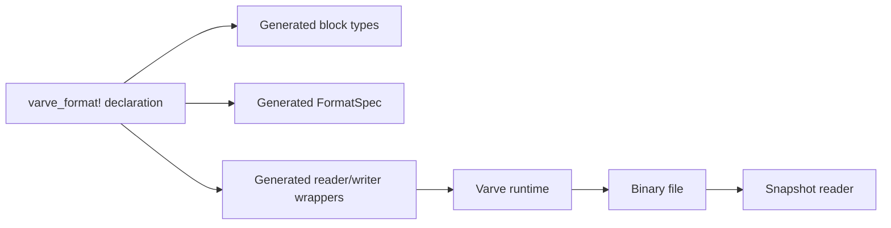
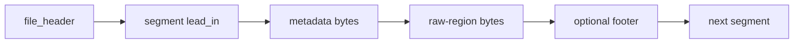
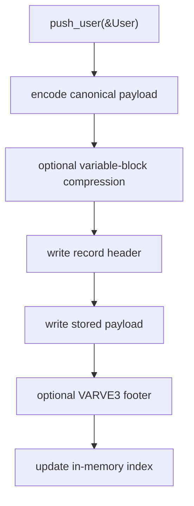
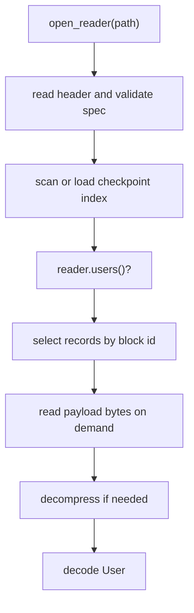
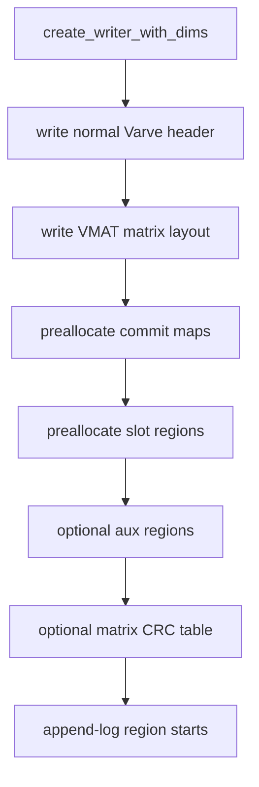
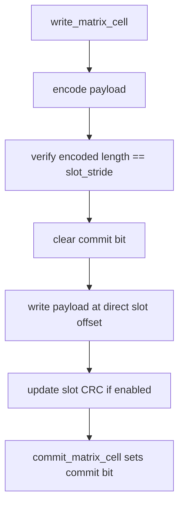
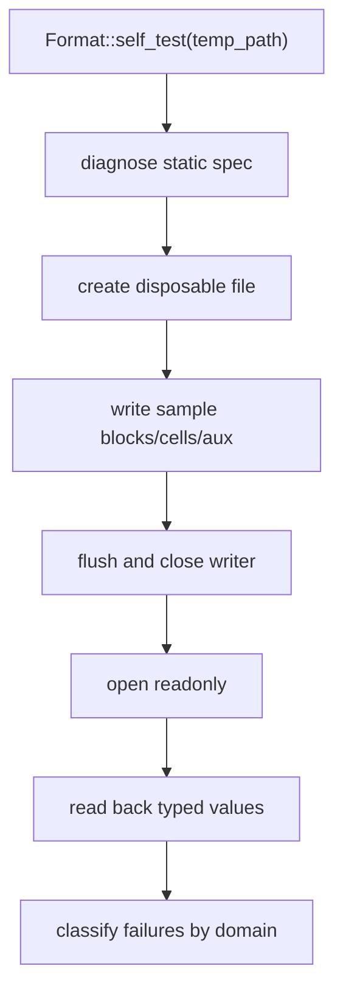

# How Varve Works

Varve is a format generator plus runtime. You declare a static file contract in
Rust, and Varve writes/reads bytes according to that contract. The format itself
is not dynamic: the static `FormatSpec` in your program remains the authority.

## The Big Picture



The macro handles repetitive code:

- explicit block ids and versions
- fixed/variable/matrix block structs
- typed writer methods
- typed reader methods
- static registry entries
- schema hash computation when requested

The runtime handles storage mechanics:

- file headers
- record headers and optional footers
- canonical encoding/decoding
- checkpoint/index scan
- compression/decompression
- integrity checks
- matrix layout, commit maps, and direct cell offsets
- writer locks and explicit durability calls

## File Header

Every file starts with:

- user magic, such as `b"APP"`
- Varve container marker: `VARVE1`, `VARVE2`, or `VARVE3`
- format version
- endian byte
- flags
- schema hash
- optional file-header extension bytes

The user magic and version prevent opening the wrong file type. The schema hash
can pin the exact declared shape when you choose `schema_hash: computed;`.

## Custom Physical Layouts

The Varve-native header is the default preset. A format can instead choose
`preset: none;` and declare its own byte-level layout. In that mode Varve does
not write `VARVE1/2/3`; the declared `file_header`, segment `lead_in`,
`metadata`, `raw_region`, and optional `footer` own the physical bytes.



Lead-in and footer fields can be literals, caller-supplied values, or finalized
offsets such as `next_segment_offset` and `raw_data_offset`. The layout writer
writes placeholders for finalized fields, writes metadata/raw/footer bytes, then
backpatches the computed values. The layout reader validates the header,
literals, finalized offsets, forward progress, and region bounds before exposing
metadata and raw byte ranges. Reopening a layout writer first runs that same
validation pass, then seeks to EOF so new segments are appended after the last
validated segment. Validated lead-in/footer values remain available on
`LayoutSegmentInfo`, so callers can inspect fields such as ToC masks without
manual byte parsing.

When multiple segment descriptors are declared, the reader dispatches each
physical segment from the leading literal lead-in prefix. A leading byte tag is
the common case; literal numeric fields immediately after that tag can further
separate segment kinds. Once a descriptor is selected, failed footer, offset, or
bounds validation is treated as corrupt file data rather than a reason to try a
different descriptor.

When the layout is declared in `varve_format!`, the macro generates a typed
physical-layout facade over that same engine. Segment caller fields become a
typed `FormatSegmentLayoutFields` struct, `write_segment_name` lowers them into
`LayoutFieldValue`s, and generated segment info getters read validated values
back from `LayoutSegmentInfo`. Raw and metadata regions intentionally remain
byte slices so TDMS-style adapters can own their metadata and channel encoding.

`inspect_layout_file` is the common inspection path. For custom physical files
it delegates to the layout reader; for Varve-native files it performs the normal
strict native scan and projects each record into the same segment range model.
The Varve-native file header, record lead-in, and optional footer are also
emitted and parsed through an internal native layout codec that feeds the same
effective `VarveFileHeader` and `VarveRecord` plan, while the higher-level
append-log, recovery, compression, and index semantics stay in the native
reader/writer.

## Append-Log Records

Fixed and variable blocks are stored as append-log records.



Each record header stores:

- block id
- block version
- flags
- sequence
- physical payload length
- checksum field
- uncompressed length hint for compressed records

Typed reads reverse the process:



Physical APIs such as `scan()`, `RecordIndexEntry::read_payload`, and mmap
payload windows expose stored bytes. Typed APIs expose logical decoded values.

## Fixed Blocks

Fixed blocks use canonical field encoding. They are fixed in the sense that the
encoded payload shape is expected to stay stable, not because Varve copies Rust
memory layout.

Use fixed blocks for:

- small records
- stable positional fields
- in-place same-size replacement

Changing a fixed block field layout should bump the block version.

## Variable Blocks

Variable blocks encode each field as:

```text
field_id + wire_type + length + payload
```

This lets readers skip unknown fields when the wire type is known. Fields can
also use `= default`, allowing old files that lack the field to decode into a
new struct.

Use variable blocks for:

- records expected to evolve
- optional/default fields
- larger payloads that may benefit from compression

## Keyed Blocks

A block declared with `key = [id]` or `key = [a, b]` gets keyed collection
helpers.

```rust
let users = reader.users()?;
let user = users.get(&7)?;
```

For repeated keys, keyed lookup returns the newest record by sequence. For
stateful updates, use `push_op`, tombstones, merge, and compact APIs.

## Commit Policies

Varve supports three append-log commit modes:

| Policy | Meaning |
| --- | --- |
| `commit: none` | records are visible after their complete header/payload is readable |
| `record_footer` | each visible record must have a valid footer |
| `transaction_marker(on_flush)` | `flush()` appends a marker; readers see marker-covered records |
| `transaction_marker(explicit)` | only `commit()` appends a marker |

Offset chains use `VARVE3` footers to link previous records with the same block
id and, for keyed generated writers, previous records with the same key.

## Flush, Sync, And Durability

`push_*` writes through the current file handle but does not imply per-record
`fsync`.

- `flush()` pushes buffered Varve records and writes configured checkpoint,
  manifest, or transaction marker records.
- `sync()` asks the operating system to durably persist the file.
- matrix durable helpers provide stronger ordered sync semantics only when you
  call them explicitly.

This is deliberate: applications choose their own durability/performance trade.

## Matrix Storage

Matrix blocks are separate from append-log records. They are for bounded grids
whose dimensions are known when the file is created.



For a dense `(scan, ch)` matrix, Varve computes direct offsets:

```text
ordinal = scan * ch_count + ch
slot_offset = slot_region_start + ordinal * slot_stride
```

Writing a matrix cell:



Readers trust commit maps. If the commit bit is clear, Varve returns
`MatrixNotCommitted` even if slot bytes exist.

## Aux Regions

`aux { thumbnail: 1024 }` creates a preallocated byte region near matrix data.
Aux bytes are not commit-controlled and do not append records. They are useful
for caller-owned caches, previews, or side data that should live in the file but
not participate in cell validity.

## Compression

Compression happens after canonical variable-block encoding and before record
write. Fixed blocks, matrix slots, and internal records are not compressed by
the append-log compression policy.

Modes:

- `record_explicit`: each compressed record carries a `VCMP` envelope.
- `file_explicit`: one file-header extension describes compression.
- `format_contract`: the static schema is the compression contract.

`ChunkedBytes` is a value-level helper for caller-managed blobs. It is not the
same as VMAT-native chunked matrix storage.

## Integrity And Recovery

With `integrity: crc32`, Varve validates record payload CRCs. In `VARVE3`, the
CRC covers payload plus footer. Matrix CRC additionally covers metadata tables,
commit maps, and committed slots.

CRC is corruption detection, not authentication. It does not protect against a
malicious writer that can recompute checksums.

Recovery is explicit. Strict open rejects corrupt tails. Recovery open may
truncate incomplete tails according to policy. Matrix recovery APIs expose
findings and safe actions; the application chooses which action to apply.

## Self-Check Flow



Self-check answers a practical question: do this format declaration, these
sample values, the enabled Cargo features, and Varve's generated APIs agree?

If self-check passes but application logic fails, inspect caller-owned policy:
runtime dimensions, key construction, commit timing, sidecar meaning, migration
functions, and custom codecs.
